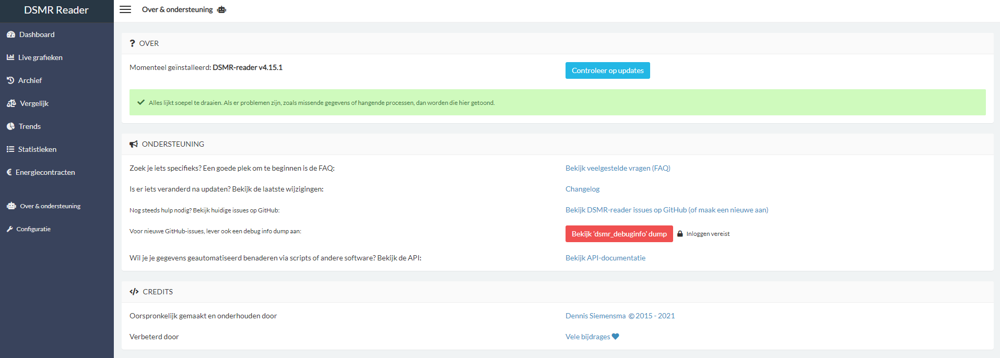

<font size="-1">

[](https://hub.docker.com/r/xirixiz/dsmr-reader-docker/tags)
[](https://hub.docker.com/r/xirixiz/dsmr-reader-docker)
[](https://github.com/xirixiz/dsmr-reader-docker/actions)
[](https://github.com/xirixiz/dsmr-reader-docker/)
[](https://www.paypal.com/donate/?business=9M4P6DGT7U7VU&no_recurring=0&item_name=Open+source+project+development.&currency_code=EUR)
[![BuyMeCoffee][buymecoffeebadge]][buymecoffee]

[buymecoffee]: https://www.buymeacoffee.com/xirixiz
[buymecoffeebadge]: https://camo.githubusercontent.com/cd005dca0ef55d7725912ec03a936d3a7c8de5b5/68747470733a2f2f696d672e736869656c64732e696f2f62616467652f6275792532306d6525323061253230636f666665652d646f6e6174652d79656c6c6f772e737667

### DSMR-reader - Docker
*DSMR-protocol reader, telegram data storage and energy consumption visualizer.
Can be used for reading the smart meter DSMR (Dutch Smart Meter Requirements) P1 port yourself at your home.
You will need a cable and hardware that can run Docker.
**Free for non-commercial use**.*

***
#### Table of contents
- [DSMR-reader - Docker](#dsmr-reader---docker)
  - [Table of contents](#table-of-contents)
  - [General info](#general-info)
  - [Screenshots](#screenshots)
  - [Technologies](#technologies)
  - [Releases](#releases)
  - [Setup / parameters](#setup--parameters)
  - [Features](#features)
  - [Issues](#issues)
  - [Inspiration](#inspiration)
  - [Contact](#contact)

***
#### General info
The purpose of this project is to provide a simplified installation of DSMR-reader using all the benefits of Docker.

***
#### Screenshots


***
#### Technologies
```text
* Docker >= 20.x
* Python 3.x
* Posgres >= 13.x
* MySQL ??.?? (untested by me)
```

***
#### Releases

This is a multi-arch image and will also run on a Raspberry Pi or other Docker-enabled ARMv6/7/8 devices.

| Image Tag   | Architectures                    | Image OS          |
| :---------- | :------------------------------- | :---------------- |
| latest      | amd64, arm32v6, arm32v7, arm64v8 | Alpine Linux 3.17 |
| development | amd64, arm32v6, arm32v7, arm64v8 | Alpine Linux 3.17 |

Docker tags/releases can be found here: https://hub.docker.com/r/xirixiz/dsmr-reader-docker/tags?page=1&ordering=last_updated

***
#### Setup / parameters

* ##### Public access warning

  Exposing your DSMR-reader installation to the Internet?
  Consider additionally using HTTP Auth (see below) or enabling *"Force password login everywhere"* in the Frontend settings in DSMR-reader, to prevent public access.

* ##### Settings

  For DSMR Reader specific environment settings, please refer to: [DSMR-reader env settings docs](https://dsmr-reader.readthedocs.io/nl/v5/reference/env-settings.html)

  It's possible to set the following settings as environment variables, for example:
  ```properties
  # Required (defaults are shown as value):
  - DJANGO_TIME_ZONE=Europe/Amsterdam
  - VIRTUAL_HOST=localhost
  # It's possible to map a UID/GID with a user/group from you local system.
  # This will not change the username, only match ID's to prevent issues with access rights!
  - DUID=803
  - DGID=803
  ```

* ##### Nginx related:
```properties
  # Default inside the container nginx is running on port 80.
  # In some cases (host network f.e.), some people requested to be able to change the default listen port.
  # However, in most cases this setting isn't being used.
  NGINX_LISTEN_PORT=80
  ```

```properties
  # Default nginx generated access logs.
  # In some cases you want to disable this, because f.e. you use a reverse proxy which also generated access logs
  DISABLE_NGINX_ACCESS_LOGS=true
  ```

  ```properties
  # Enables port 443 for nginx
  # /etc/ssl/private/fullchain.pem and /etc/ssl/private/privkey.pem are required to be mounted!
  ENABLE_NGINX_SSL=false
  ```

  Nginx .httpassword (thanks @Caroga):
  ```properties
  ENABLE_HTTP_AUTH=false
  HTTP_AUTH_USERNAME=
  HTTP_AUTH_PASSWORD=
  ```
It's not possible to combine those settings!!!:
  ```properties
  ENABLE_NGINX_SSL
  NGINX_LISTEN_PORT
  ```

* ##### DSMR related (defaults are shown as value):
  ```properties
  # Webinterface user:
  DSMRREADER_ADMIN_USER=admin
  # Webinterface user password:
  DSMRREADER_ADMIN_PASSWORD=admin
  # Loglevel. Valid values are WARNING, INFO, DEBUG:
  DSMRREADER_LOGLEVEL=WARNING
  # Secret key for encryption:
  DJANGO_SECRET_KEY=dsmrreader
  # Ignore database size notifications:
  DSMRREADER_SUPPRESS_STORAGE_SIZE_WARNINGS=True
  # Plugins (custom) setup:
  DSMRREADER_PLUGINS=dsmr_plugins.modules.plugin_name1,dsmr_plugins.modules.plugin_name2
  # Enable IFrame support (f.e. for use in HASS).
  ENABLE_IFRAME=false
  ```

* ##### DB related (defaults are shown as value):
  ```properties
  # Optional. Vacuum clean Postgres on startup:
  VACUUM_DB_ON_STARTUP=false
  # Required. Defaults are set to:
  DJANGO_DATABASE_ENGINE=django.db.backends.postgresql
  DJANGO_DATABASE_NAME=dsmrreader
  DJANGO_DATABASE_USER=dsmrreader
  DJANGO_DATABASE_PASSWORD=dsmrreader
  DJANGO_DATABASE_HOST=dsmrdb
  DJANGO_DATABASE_PORT=5432
  DJANGO_DATABASE_CONN_MAX_AGE=60
  ```

* ##### DSMR Datalogger related
  When you are connecting to P1 via a network socket, you need to run DSMR Reader in standalone mode.
  Ignore the errors about /dev/ttyUSB* and head over to the DSMR Reader datalogger configuration in the admin panel
  and configure the setting so it matches your environment. More info: https://github.com/xirixiz/dsmr-reader-docker/issues/303#issuecomment-1345383612
  - DSMRREADER_OPERATION_MODE - Run DSMR Reader in 1 of the following modes (default is standalone with the serial flavor):
    - standalone - Run all processes, including backend, GUI and datalogger. There are two flavors:
      - standalone - serial - Use a serial connection for the datalogger.
      - standalone - ipv4 - Use a network socket for the datalogger.
    - api_server - Run all processes, except the datalogger process. A remote datalogger is required to collect DSMR Reader telegrams.
    - api_client - Only start the datalogger client, which sends the P1 telegrams to the api_server. It is required to setup DATALOGGER_API_* environment variables.

  

  

  

* ##### DSMR Reader datalogger - standalone - serial (default):
  More info: [DSMR-reader remote datalogger installation docs](https://dsmr-reader.readthedocs.io/nl/v5/how-to/installation/remote-datalogger.html#a-serial-port-env).
  The default startup values for DSMR Reader standalone are:
  ```properties
  DSMRREADER_REMOTE_DATALOGGER_INPUT_METHOD=serial
  DSMRREADER_REMOTE_DATALOGGER_SERIAL_PORT=/dev/ttyUSB0

  # DSMR meter version 4/5
  DSMRREADER_REMOTE_DATALOGGER_SERIAL_BAUDRATE=115200
  DSMRREADER_REMOTE_DATALOGGER_SERIAL_BYTESIZE=8
  DSMRREADER_REMOTE_DATALOGGER_SERIAL_PARITY=N
   ```

  Some meters are running on an older version and can be set providing the values:
  ```properties
  # DSMR meter version 2/3 settings
  DSMRREADER_REMOTE_DATALOGGER_SERIAL_BAUDRATE=9600
  DSMRREADER_REMOTE_DATALOGGER_SERIAL_BYTESIZE=7
  DSMRREADER_REMOTE_DATALOGGER_SERIAL_PARITY=E
  ```

* ##### DSMR Reader datalogger - standalone - ipv4:
  More info: [DSMR-reader remote datalogger installation docs](https://dsmr-reader.readthedocs.io/nl/v5/how-to/installation/remote-datalogger.html#b-network-socket-env).
  Instead of a serial connection it's also possible to use a network socket instead. You need to define the following variables:
  ```properties
  DSMRREADER_REMOTE_DATALOGGER_INPUT_METHOD=ipv4
  DSMRREADER_REMOTE_DATALOGGER_NETWORK_HOST=127.0.0.1 (default)
  DSMRREADER_REMOTE_DATALOGGER_NETWORK_PORT=2000 (default)
  ```

* ##### Remote DSMR datalogger - api_client
  More info: [DSMR-reader remote datalogger installation docs](https://dsmr-reader.readthedocs.io/nl/v5/how-to/installation/remote-datalogger.html#api-config-env).
  ```properties
  # Required. Instructs dsmr reader to start in api_client mode
  DSMRREADER_OPERATION_MODE=api_client
  # Required. Destination(s) of the DSMR Reader (Docker) host(s)
  DSMRREADER_REMOTE_DATALOGGER_API_HOSTS=x
  # Required. Add the API keys of the DSMR Reader (Docker) destination host(s)
  DSMRREADER_REMOTE_DATALOGGER_API_KEYS=x
  ```
* ##### Remote DSMR datalogger - api_server
  More info: [DSMR-reader remote datalogger installation docs](https://dsmr-reader.readthedocs.io/nl/v5/how-to/installation/remote-datalogger.html#api-config-env).
  The configured api_client will push data to the api_server. The only difference between standalone and api_server is that the datalogger process isn't running.
  ```properties
  # Required. Instructs dsmr reader to start in api_server mode, which means no datalogger process.
  # all telegrams are coming in through the API
  DSMRREADER_OPERATION_MODE=api_server
  ```

* ##### Remote DSMR datalogger - Optional settings
  More info: [DSMR-reader remote datalogger installation docs](https://dsmr-reader.readthedocs.io/nl/v5/how-to/installation/remote-datalogger.html#other-settings-env).
  ```properties
  DSMRREADER_REMOTE_DATALOGGER_TIMEOUT=x
  DSMRREADER_REMOTE_DATALOGGER_SLEEP=x
  DSMRREADER_REMOTE_DATALOGGER_DEBUG_LOGGING=false
  ```

* ##### Run with docker-compose
  An example docker-compose.yaml file can be found here: https://raw.githubusercontent.com/xirixiz/dsmr-reader-docker/master/examples/docker-compose.example.yaml.<br/>

  You should modify the docker-compose file with parameters that suit your environment, then run docker-compose afterwards:
  ```bash
  docker-compose up -d
  ```
  After starting the containers with docker-compose, the dashboard is reachable at
  ```text
  http://<hostname>:7777
  ```
  After starting the containers, don't forget to modify the default DSMR version (default is DSMR v4):
  ```text
  http://<hostname>:7777/admin/dsmr_datalogger/dataloggersettings/
  ```

* ##### Run with Docker run
  Keep in mind the example below only runs dsmr, you need to run a postgres docker container or traditional postgres environment as well, since a database is needed.

  ```bash
  docker run -d \
    --name dsmr \
    --restart always \
    -p 7777:80 \
    -p 7779:443 \
    -e DJANGO_TIME_ZONE=Europe/Amsterdam \
    -e DJANGO_DATABASE_HOST=x.x.x.x \
    -e DJANGO_DATABASE_USER=dsmrreader \
    -e DJANGO_DATABASE_PASSWORD=dsmrreader \
    -e VIRTUAL_HOST=localhost \
    --no-healthcheck \
    --device /dev/ttyUSB0:/dev/ttyUSB0 \
    xirixiz/dsmr-reader-docker
  ```

The ```--no-healthcheck``` argument should only be used when the containers function NOT presenting the DSMR Reader webinterface, for example the datalogger sender mode. By default this argument should not be used!

***
#### Features
* ##### DSMR Reader - Database cleanup/vacuum
  It could be that you receive a notification that the database is growing, like in this issue: https://github.com/dsmrreader/dsmr-reader/issues/1165.

  You can cleanup the Docker database by running the following command from the application container:
  ```bash
  docker exec -ti dsmr bash -c '/app/cleandb.sh'
  ```

  Or if you'd like to run verbose:
  ```bash
  docker exec -ti dsmr bash -c '/app/cleandb.sh -v'
  ```
* ##### DSMR Reader - Plugins
  DSMR Reader plugins (https://dsmr-reader.readthedocs.io/en/latest/plugins.html) can be added by adding the plugin with a volume mapping and using it in the environmental variable to load it.

  ```yaml
  volumes:
    - ./modules/forward_telegram_to_api.py:/app/dsmr_plugins/modules/forward_telegram_to_api.py
  environment:
    - DSMRREADER_PLUGINS=dsmr_plugins.modules.forward_telegram_to_api
  ```

* ##### Backup and restore mechanism 1
  dsmrdb in docker-compose is configured to use a docker volume. So when the application and docker containter have been removed, the postgres data still persists.

  Also you could easily create a backup. Values depend on docker/docker-compose user and database variables:
  ```bash
  docker-compose stop dsmr
  docker exec -t dsmrdb pg_dumpall -c -U dsmrreader > dsmrreader.sql
  docker-compose start dsmr
  ```

  It's also possible to gzip ofcourse:
  ```bash
  docker exec -t dsmrdb pg_dumpall -c -U dsmrreader | /bin/gzip > dsmrreader.sql.gz
  ```

  Or drop the database and restore a backup. Values depend on docker/docker-compose user and database variables:
  ```bash
  docker-compose stop dsmr
  docker exec -t dsmrdb dropdb dsmrreader -U dsmrreader
  docker exec -t dsmrdb createdb -O dsmrreader dsmrreader -U dsmrreader
  cat dsmrreader.sql | docker exec -i dsmrdb psql -U dsmrreader
  docker-compose start dsmr
  ```

* ##### Backup and restore mechanism 2
    Ofcourse it's also possible to use Docker's own volume backup and restore megansim.

    Backup:
    ```bash
    docker run -it --rm -v dsmrdb:/volume -v /tmp:/backup alpine \
      tar -cjf /backup/dsmrdb.tar.bz2 -C /volume ./
    ```

    Restore:
    ```bash
    docker run -it --rm -v dsmrdb:/volume -v /tmp:/backup alpine \
      sh -c "rm -rf /volume/* /volume/..?* /volume/.[!.]* ; tar -C /volume/ -xjf /backup/dsmrdb.tar.bz2"
    ```

* ##### Backup mechanism 3
  Be aware this backup is done via the dsmr container, not via the dsmrdb container!
  Backup:
  ```bash
  docker exec -ti dsmr bash -c 'PGPASSWORD=${DJANGO_DATABASE_PASSWORD} /usr/bin/pg_dump \
    -h "${DJANGO_DATABASE_HOST}" \
    -p "${DJANGO_DATABASE_PORT}" \
    -d "${DJANGO_DATABASE_NAME}" \
    -U "${DJANGO_DATABASE_USER}"'
  ```

* ##### Postgres upgrade (docker)
  ```text
  - stop the dsmr reader container ONLY
  - backup the dsmrdb database (see "Backup and restore mechanism" in the README.md)
  - validate the dsmrdb backup!
  - you could also consider to "vacuum" the database following "DSMR Reader - Database cleanup/vacuum" in the README.md.
  - stop and remove the dsmrdb container
  - rename the db folder that is mounted in the Docker container, containing the database data, to something else (.old, or whatever you like)
  - create a new db folder with the name used to mount the folder in the Docker container (so, the folder name just before you renamed it in the previous step)
  - update docker-compose or your docker run command with the new postgres version
  - be aware the client package has to be compatible with the postgres version you're going to use. Check here which version is within the dsmr image.
  - start dsmrdb (it's an empty but valid postgres db now).
  - restore the database backup created in step 2 (see "Backup and restore mechanism" in the README.md)
  - restart the dsmrdb container
  - start the dsmr container
  ```
* ##### UID/GID
  When using volumes (`-v` or `--volume` flags) permissions issues can occur between the host OS and the container, to avoid this you can specify a user id `DUID` and group id `DGID` from the local system in the Docker container. Make sure the owner of the directory has all permissions on the volume you'd like to mount into the Docker container.

  You can identify a UID or GID by executing the following command

  ```bash
    id xirixiz
    uid=1000(xirixiz) gid=1000(xirixiz) groups=1000(xirixiz) 1001(docker)
  ```

***
#### Issues
* ##### MySQL backend - issue with DSMR running on top of MySQL - configured timezone info tables.
  It manifests as "Data processing is lagging behind" message on the web-interface and with only leading information in the logs if they set to DEBUG "Missing consumption data for:"
  \
  If you drill down from here then you can eventually find this issue: dsmrreader/dsmr-reader#909
  \
  Which can be resolved by installing timezone info tables in MySQL: https://dev.mysql.com/doc/refman/8.0/en/mysql-tzinfo-to-sql.html

* ##### Raspberry Pi
  This issue is caused by the upgrade from Alpine 3.12 to 3.13.
  Alpine 3.13 requires the following on the host OS (https://wiki.alpinelinux.org/wiki/Release_Notes_for_Alpine_3.13.0#time64_requirements):
  ```
  - Docker 19.03.9 or newer
  - libseccomp 2.4.2 or newer
  ```
  The libseccomp package hasn't been updated for Debian stable yet, Therefore, this image won't run on any Debian (or Raspbian) stable host.

  Fix:
  ```bash
  sudo apt-key adv --keyserver keyserver.ubuntu.com --recv-keys 04EE7237B7D453EC 648ACFD622F3D138
  echo 'deb http://httpredir.debian.org/debian buster-backports main contrib non-free' | sudo tee -a /etc/apt/sources.list.d/debian-backports.list
  sudo apt update
  sudo apt install libseccomp2 -t buster-backports
  ```

* ##### Incorrect timestamps
  Mounting ```/etc/localtime:/etc/localtime``` results most of the times in an incorrect timestamp in DSMR Reader (+/- 1 hour). Removig the mount usually solves the problem.

* ##### Synology
  For Synology, or maybe other NAS appliances, an additional driver is required:
  * Drivers are required for DSM < 7.0: http://www.jadahl.com/drivers_6.1 or http://www.jadahl.com/drivers_6.2
  * Drivers to enable USB for DSM > 7.0: http://www.jadahl.com/iperf-arp-scan/DSM_7.0/
  ```sh
  sudo insmod /lib/modules/usbserial.ko
  sudo insmod /lib/modules/ftdi_sio.ko
  ```
  * The docker-compose file must be set to version 3.2 or lower.

***
#### Inspiration
Project inspired by the hard work and effort of [@dennissiemensma](https://github.com/dsmrreader)

***
#### Contact
Created by [@xirixiz](https://github.com/xirixiz) - feel free to contact me!
